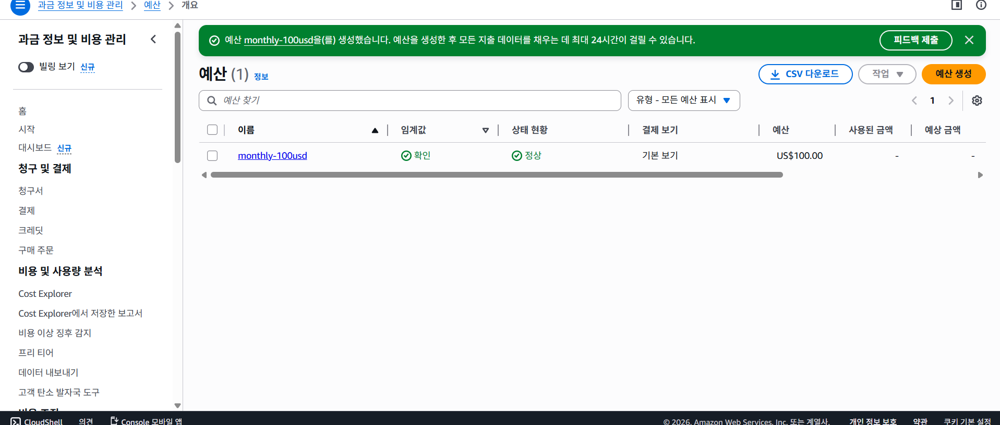
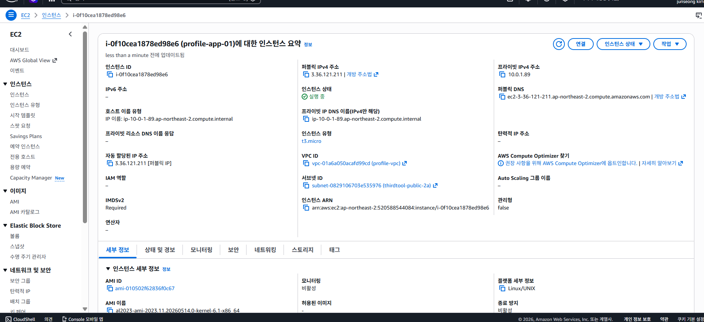
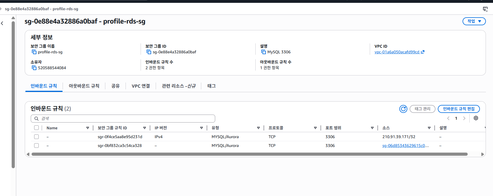
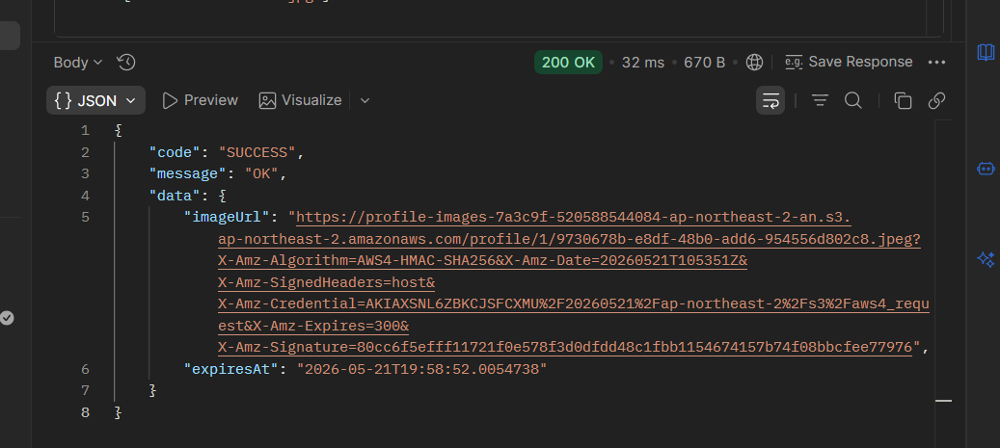
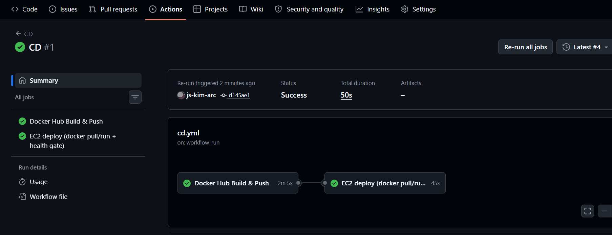
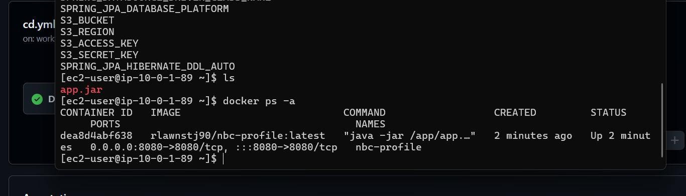
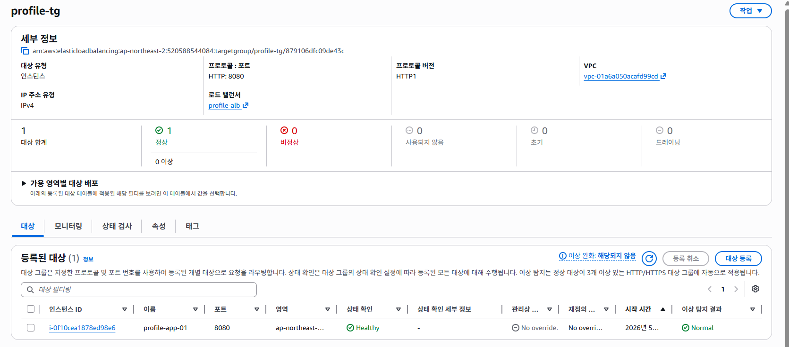

# nbc-profile

클라우드 주차 과제입니다.

---

## 실행 (Profile 별)

본 프로젝트는 환경별 설정을 `application-{profile}.yml` 로 분리. 상세 결정은 [ADR-0008](docs/adr/0008-profile-based-yml-split.md) 참조.

### local (기본값, H2 in-memory)

```powershell
# profile 미지정 - application.yml 의 spring.profiles.default: local 활용
./gradlew.bat bootRun

# 또는 명시
./gradlew.bat bootRun --args="--spring.profiles.active=local"
```

- H2 콘솔: <http://localhost:8080/h2-console> (`jdbc:h2:mem:testdb`, user `sa`, password `sa`)
- 로그: `nbc.profile=DEBUG`, Hibernate SQL=DEBUG, `show-sql: true`
- S3: 공통 `application.yml` 의 디폴트 placeholder 사용 (`my-toy-bucket` / `ap-northeast-2`). 실제 호출 시점에 AWS 자격증명이 없으면 호출이 실패하지만, 컨텍스트 로딩 자체는 정상.

### test (단위/통합 테스트)

```powershell
./gradlew.bat test
```

- `InMemoryFileStorageAdapter` 활성 (S3 어댑터 비활성, `@Profile("!test")`).
- `ProfileSmokeTest` 가 두 profile (local + test) 의 컨텍스트 로딩 + 어댑터 주입 타입을 자동 검증.

### prod (운영 환경, 환경변수 필수)

`application-prod.yml` 은 모든 환경 의존 값을 *strict placeholder* (디폴트 없음) 로 둔다. 환경변수 누락 시 *부팅 실패* — 의도된 fail-fast.

PowerShell:

```powershell
$env:SPRING_PROFILES_ACTIVE = "prod"
$env:DB_URL = "jdbc:mysql://..."
$env:DB_USERNAME = "..."
$env:DB_PASSWORD = "..."
$env:S3_BUCKET = "..."
$env:S3_REGION = "..."
java -jar build/libs/demo-0.0.1-SNAPSHOT.jar
```

Bash:

```bash
SPRING_PROFILES_ACTIVE=prod \
  DB_URL=jdbc:mysql://... \
  DB_USERNAME=... \
  DB_PASSWORD=... \
  S3_BUCKET=... \
  S3_REGION=... \
  java -jar build/libs/demo-0.0.1-SNAPSHOT.jar
```

S3 자격증명 (`S3_ACCESS_KEY` / `S3_SECRET_KEY`) 은 미설정 시 *DefaultCredentialsProvider* 가 fallback — IAM Role · `~/.aws/credentials` · AWS_* 환경변수 등에서 자동 탐색 ([ADR-0004](docs/adr/0004-s3-credentials-nullable-fallback.md)).

---

## 시크릿 컨벤션

- yml 파일에 시크릿 (DB password · S3 access key 등) *직접 기재 금지* — 모두 `${VAR}` placeholder.
- 로컬 개발 시 `.env` · IDE Run Configuration · `direnv` 등으로 주입.
- 운영은 systemd 서비스 파일 · AWS Parameter Store · Secrets Manager 등 외부 비밀 저장소가 placeholder 를 채움.

---

## 문서 진입

- 작업 흐름 · 규칙: `CLAUDE.md`
- 도메인 의도: `docs/DOMAIN.md`
- 패키지 · BC 구조: `docs/PACKAGE.md`
- 아키텍처 결정 기록: `docs/adr/index.md`
- 현재 Epic / Story: `workflow/epic/epic.md`, `workflow/story/story.md`

---

## Docker 로컬 실행

멀티스테이지 Dockerfile (builder=JDK / runtime=JRE) — 결정 근거는 [ADR-0011](docs/adr/0011-multistage-docker-build-strategy.md).

### 빌드 + 기동

```powershell
# 빌드 (의존성 레이어 캐시 분리 — 소스만 바뀐 재빌드는 deps 재사용)
docker build -t nbc-profile:local .

# local profile (H2 in-memory) 기동
docker run --rm -d -p 8080:8080 --name nbcp `
  -e SPRING_PROFILES_ACTIVE=local nbc-profile:local

# 헬스체크 (ADR-0010)
curl http://localhost:8080/actuator/health   # {"status":"UP"}

# 로그 / 정지
docker logs nbcp
docker stop nbcp
```

### 환경변수 주입 (prod profile)

```powershell
# .env.example 을 복사해 .env 작성 (gitignore 대상)
copy .env.example .env
# 값 채운 뒤
docker run --rm -p 8080:8080 --env-file .env nbc-profile:local
```

- `.env` 의 `SPRING_PROFILES_ACTIVE=prod` 일 때 DB_*, S3_BUCKET, S3_REGION 미설정 시 *부팅 실패* — ADR-0008 의도된 fail-fast.
- S3 자격증명 미설정 시 `DefaultCredentialsProvider` fallback (ADR-0004) — IAM Role / `~/.aws/credentials` / AWS_* 환경변수 탐색.

### 이미지 크기 비교 (멀티스테이지 vs 단일스테이지)

2026-05-23 측정 (로컬 Windows + Docker Desktop 28.3.2, base = `eclipse-temurin:21-jdk/jre`).

| 빌드 방식 | 이미지 크기 | 비고 |
|---|---|---|
| 단일스테이지 (`temurin:21-jdk` 만) | **1.04GB** | JDK + Gradle 캐시 + src 잔존 |
| 멀티스테이지 (현재 `Dockerfile`) | **394MB** | runtime 은 JRE + jar (~73MB) 만 |
| **절감** | **−646MB / −62.1%** | — |

> 측정 방법: 임시 `Dockerfile.single` 로 단일스테이지 빌드 후 `docker images` 비교. 측정 후 임시 파일은 삭제 (커밋 금지 — 두 파일 drift 위험).

### 빌드 산출물 미포함 검증

```powershell
# runtime layer 에 JDK · Gradle 흔적이 없는지 확인
docker history nbc-profile:local --no-trunc | findstr /i "gradle jdk"   # 결과 0줄 기대
```

---

## CI (GitHub Actions)

`.github/workflows/ci.yml` — 결정 근거는 [ADR-0012](docs/adr/0012-github-actions-ci-pipeline.md).

### 트리거 / 동작

- `push: main` / `pull_request: main` — 두 시점 모두 동일 워크플로 실행 → 머지 게이트.
- `runs-on: ubuntu-latest`, JDK 21 Temurin.
- 한 PR 에 새 커밋 push 시 진행 중 실행 자동 취소 (`concurrency: cancel-in-progress`).

### Step 구성

1. `checkout` → `setup-java(21, temurin)` → `setup-gradle` (네이티브 캐시)
2. `./gradlew clean build` (compile + test + jar)
3. 테스트 실패 시 워크플로 전체 fail — *실패한 채로 머지 불가*.

### Artifact

| 이름 | 시점 | 내용 | 보존 |
|---|---|---|---|
| `test-reports` | `if: always()` (실패 시도) | `build/reports/tests` HTML | 7일 |
| `app-jar` | `if: success()` | `build/libs/*-SNAPSHOT.jar` | 7일 |

Actions UI 의 워크플로 실행 페이지 하단 "Artifacts" 에서 다운로드.

### 캐시 동작

`gradle/actions/setup-gradle@v4` 가 `~/.gradle/caches`, wrapper, configuration-cache 를 자동 관리.
2회차 실행부터 의존성 다운로드/컴파일 캐시 재사용으로 시간 단축 (실측은 Actions UI 의 step duration 참고).

### Branch Protection (선택, GitHub UI)

PR 머지 게이트로 강제하려면: GitHub repo → Settings → Branches → main → "Require status checks to pass before merging" 체크 후 `Build & Test (JDK 21)` 선택.

---

## CD (Docker Hub Push + EC2 Pull)

`.github/workflows/cd.yml` — 결정 근거는 [ADR-0013](docs/adr/0013-cd-dockerhub-ec2.md).

### 트리거 흐름

```
main push
  → CI (ci.yml) gradle clean build → 그린
    → CD (cd.yml) workflow_run trigger (event=push 가드)
      → docker build (buildx, GHA cache)
      → docker push {DOCKERHUB_USERNAME}/nbc-profile:{SHA} + :latest
        → SSH (appleboy/ssh-action) → ec2-user@EC2_HOST
          → docker pull / stop / rm / run -d --restart=always --env-file /home/ec2-user/.env
            → health gate: /actuator/health UP polling (최대 60s)
```

PR 빌드는 `workflow_run.event == 'push'` 가드로 CD 미실행.

### GitHub Secrets (Settings → Secrets and variables → Actions → New repository secret)

| Secret | 값 | 비고 |
|---|---|---|
| `DOCKERHUB_USERNAME` | Docker Hub 사용자명 | 이미지 경로 prefix |
| `DOCKERHUB_TOKEN` | Docker Hub Access Token | Read+Write+Delete 권한 |
| `EC2_HOST` | `3.36.121.211` | EC2 Public IP — Elastic IP 미사용 → stop/start 시 갱신 |
| `EC2_SSH_KEY` | `profile-key.pem` 전체 | BEGIN/END 라인 포함 |

### EC2 사전 준비 (1회)

```bash
# 1) SSH 접속
ssh -i "C:\study\study_related_important\profile-key.pem" ec2-user@3.36.121.211

# 2) docker 설치 (AL2023)
sudo dnf install -y docker
sudo systemctl enable --now docker
sudo usermod -aG docker ec2-user
# (재로그인 — exit 후 다시 ssh)

# 3) /home/ec2-user/.env 작성 (prod 환경변수)
cat > /home/ec2-user/.env <<'EOF'
SPRING_PROFILES_ACTIVE=prod
DB_URL=jdbc:mysql://...
DB_USERNAME=...
DB_PASSWORD=...
S3_BUCKET=...
S3_REGION=ap-northeast-2
# S3_ACCESS_KEY/S3_SECRET_KEY 는 IAM Role 사용 시 생략 (ADR-0004 fallback)
EOF
chmod 600 /home/ec2-user/.env

# 4) systemd 유닛 배치 (부팅 안전망)
# 본 repo 의 deploy/profile-app.service 를 scp 또는 직접 복사
sudo cp profile-app.service /etc/systemd/system/
sudo systemctl daemon-reload
sudo systemctl enable profile-app
# 컨테이너가 아직 없으므로 systemctl start 는 첫 배포 후

# 5) 첫 배포 — cd.yml 자동 또는 수동 deploy.sh
DOCKERHUB_USERNAME=<your-user> ./deploy.sh
sudo systemctl start profile-app   # 이후 부팅 시 자동 기동
```

### 환경변수 갱신 절차

| 대상 | 절차 |
|---|---|
| **GitHub Secrets** | Settings → Secrets → 해당 Secret → Update value |
| **EC2 .env** | SSH 접속 → `vi /home/ec2-user/.env` → 다음 배포에 자동 반영 (cd.yml 이 매번 --env-file 재주입) |
| **신규 환경변수 추가** | (a) `.env.example` 업데이트 + 커밋 (b) EC2 `.env` 수정 (c) (필요 시) GitHub Secret 추가 (d) 다음 배포 자동 적용 |

### 롤백 (특정 SHA 로 되돌리기)

```bash
# SSH 접속 후
SHA=<롤백할_커밋_SHA>
DOCKERHUB_USERNAME=<user>
docker pull "${DOCKERHUB_USERNAME}/nbc-profile:${SHA}"
docker tag  "${DOCKERHUB_USERNAME}/nbc-profile:${SHA}" "${DOCKERHUB_USERNAME}/nbc-profile:latest"
sudo systemctl restart profile-app
# 또는 deploy.sh <sha> 한 줄로 동일 시퀀스
```

### 배포 모니터링

- GitHub Actions UI: cd.yml 실행 로그 (build-and-push + deploy step 별 timing)
- EC2: `docker ps`, `docker logs nbc-profile --tail 100 -f`, `sudo journalctl -u profile-app -f`
- 외부: `curl http://3.36.121.211:8080/actuator/health` → `{"status":"UP"}`


## 인프라 (Product 2: VPC + EC2)

### EC2 인스턴스 정보

| 항목 | 값 |
|---|---|
| Instance ID | `i-0abc1234...` |
| Public IPv4 | `3.36.121.211` |
| 인스턴스 타입 | t3.micro (Free Tier) |
| AMI | Amazon Linux 2023 (x86_64) |
| VPC / Subnet | `profile-vpc` / `profile-public-2a` (10.0.1.0/24) |
| Security Group | `profile-app-sg` (22/80/8080, My IP only) |
| 접속 URL (배포 후) | `http://3.36.121.211:8080` |

> **주의:** Elastic IP 미사용 결정(`ADR-NET-004`)으로, 인스턴스 stop/start 시 Public IP가 변경됩니다. 본 IP는 *최종 커밋 시점 기준*입니다.

### SSH 접속

```powershell
ssh -i "C:\study\study_related_important\profile-key.pem" ec2-user@3.36.121.211
```

### 본인 IP 변경 시 SG 갱신 절차

SSH가 `Connection timed out`으로 실패하면, 보안 그룹 인바운드의 등록된 IP가 *현재 본인 IP와 다른 상태*입니다 (Wi-Fi 전환·모바일 핫스팟·VPN 변경 등). 아래 절차로 5분 내 복구.

1. 현재 본인 IP 확인
```powershell
   curl https://checkip.amazonaws.com
```
2. AWS Console → EC2 → Security Groups → `profile-app-sg`
3. Inbound rules 탭 → Edit inbound rules
4. 22 / 80 / 8080 세 룰의 Source를 `<NEW_IP>/32`로 갱신 (Source 드롭다운 → **My IP** 선택하면 자동 입력)
5. Save rules → SSH 재시도

### 인스턴스 재시작 시 주의

- 인스턴스 stop → start 시 Public IP가 변경됨 (Elastic IP 미사용)
- 재시작 후 README의 Public IP를 *수동 갱신*해야 함
- 학습 중에는 *인스턴스를 의도적으로 중지하지 않는 것*이 운영 절차 (Free Tier 750시간/월 = 24/7 가능)

### 인프라 다이어그램

\`\`\`
[My PC]
│ SSH (22) / HTTP (80) / 8080
│ My IP /32 only
▼
┌──────────────────────────────────────────┐
│ profile-vpc (10.0.0.0/16)                │
│  ┌─────────────────────────────────────┐ │
│  │ Public Subnet 10.0.1.0/24 (2a)      │ │
│  │   ┌──────────────────────┐          │ │
│  │   │ EC2 profile-app-01   │          │ │
│  │   │  t3.micro, AL2023    │          │ │
│  │   └──────────────────────┘          │ │
│  └─────────────────────────────────────┘ │
│  ┌─────────────────────────────────────┐ │
│  │ Public Subnet 10.0.2.0/24 (2c)      │ │
│  │  (empty - reserved for ALB in P7)   │ │
│  └─────────────────────────────────────┘ │
│  ┌─────────────────────────────────────┐ │
│  │ Private Subnet 10.0.11.0/24 (2a)    │ │
│  │  (empty - reserved for RDS in P7)   │ │
│  └─────────────────────────────────────┘ │
│  ┌─────────────────────────────────────┐ │
│  │ Private Subnet 10.0.12.0/24 (2c)    │ │
│  │  (empty - reserved for RDS in P7)   │ │
│  └─────────────────────────────────────┘ │
│  Internet Gateway: profile-igw           │
└──────────────────────────────────────────┘
\`\`\`

## 과제 실행 내용


## 🏗️ 단계별 구축 과정

과제를 lv0부터 lv5까지 단계적으로 해결하며 인프라를 확장했습니다.

### lv0. 요금 폭탄 방지 AWS Budget 설정
초기 단계로 예산 관리 기능을 구현했습니다.



### lv1. 네트워크 구축 및 핵심 기능 배포
애플리케이션을 EC2 인스턴스에 배포했습니다.



### lv2.  DB 분리 및 보안 연결하기
RDS(MySQL)를 Private Subnet에 두고 애플리케이션과 연동했습니다.



### lv3. 프로필 사진 기능 추가와 권한 관리
S3 객체 접근용 Presigned URL을 발급받았습니다.

발급받은 Presigned URL:
https://profile-images-7a3c9f-520588544084-ap-northeast-2-an.s3.ap-northeast-2.amazonaws.com/profile/1/9730678b-e8df-48b0-add6-954556d802c8.jpeg?X-Amz-Algorithm=AWS4-HMAC-SHA256&X-Amz-Date=20260521T105351Z&...

- 만료 시간(expiresAt): `2026-05-21T19:58:52`
- 유효 기간: 300초 (X-Amz-Expires=300)



### lv4.  Docker & CI/CD 파이프라인 구축
GitHub Actions로 CI/CD를 구성하고, EC2에 자동 배포되도록 했습니다.





### lv5. 고가용성 아키텍처와 보안 도메인 연결 (ALB + ASG + HTTPS)
HTTPS 적용된 도메인 URL
: https://nbc-profile.com

ASG를 구성하고, 인스턴스가 ALB Target Group에 정상 등록되도록 했습니다.


